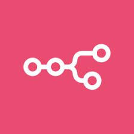
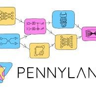
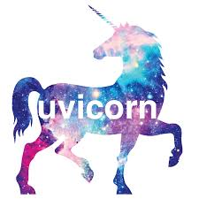
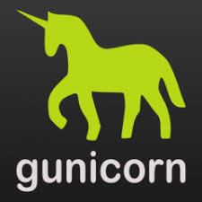
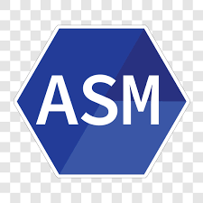
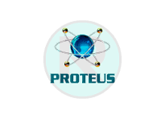

  <h1 align="center">Hi there, I'm Ignacio A. Schwindt 👋</h1>
  
  

  <strong>AI Engineer & Computer Engineering Student @ UNLP.</strong>  
  I bridge the gap between high-level logic and low-level signals, building <strong>software that thinks</strong> (AI/LLMs) and <strong>hardware that interacts</strong> (Embedded).

  
  

 

  

 

---

### 🔭 Featured Projects (AI & R&D)

| Domain | Project | Description |
| :--- | :--- | :--- |
| 🏦 **Fullstack AI Agent** | **[VaultMind AI](https://github.com/igna-s/VaultMind-AI-RAG-Banking-Agent)** | Full-stack **RAG** system demo for banking. Features **LangGraph**, **FastAPI**, and **React**. Powered by **Groq** and **Voyage AI**. |
| 🤖 **Realtime Live AI** | **[Realtime AI Avatar](https://github.com/igna-s/Realtime_Avatar_AI_Companion)** | End-to-end interface powered by **Google Gemini**. Features a customizable **VRM** character with low-latency voice interaction. |
| ⚛️ **RAG & Quantum** | **[Qiskit Migration Assistant](https://github.com/igna-s/Qiskit-RAG-Migration-Assistant)** | **RAG pipeline** designed to migrate legacy Quantum code using **n8n** and **VectorDBs** for context-aware suggestions. |
| 🎬 **AI Pipeline** | **[AI Video Generation Pipeline](https://github.com/igna-s/AI-Video-Generation-Pipeline)** | Local video generator that creates audio, video, subtitles, background music and a talking head avatar. Powered by local AI models. |
| 🧠 **AI Core** | **[Michigrad Engine](https://github.com/igna-s/Michigrad-Autograd-Engine)** | Scalar-valued **autograd engine** implemented from scratch. Replicates PyTorch's logic to demonstrate **backpropagation**. |
| 🛡️ **Embedded** | **[Embedded Security CIAA](https://github.com/igna-s/Embedded-Security-System-CIAA)** | Real-time system for **EDU-CIAA (ARM Cortex-M4)**. Features **FSM logic**, interrupt handling, and GPIO management in C. |
| 🖐️ **IoT/Hard** | **[Multitouch Surface](https://github.com/igna-s/IoT-Multitouch-Surface)** | Low-cost interactive surface powered by **ESP8266** and **HX711** load cells with real-time pressure visualization. |
| 🎮 **Python Dev** | **[Python Arcade Platform](https://github.com/igna-s/Python-Arcade-Games)** | Modular arcade collection recreated with **Pygame**. Features **OOP Design** and game logic implementation. |

---

### 🏆 Competitions & Open Source

| Event | Project | Description |
| :--- | :--- | :--- |
| 🤖 **Google MLSys** | **[MLSys Competition Track](https://github.com/igna-s/MLSys)** | My submission for the **Google MLSys Competition Track** — scheduling & optimization problems in **C++**, focused on ML systems performance. |
| 🚀 **AMD Hackathon** | **[Meridian AI Agent](https://github.com/igna-s/Meridian-Ai-Agent)** | AI-first project management platform built for a **lablab.ai hackathon**. Serverless architecture powered by **React** + **AMD MI300X** inference endpoint. |
| ⚔️ **ICPC 2025** | **[ICPC Regional Finals 2025](https://github.com/igna-s/ICPC-Regional-Finals-2025)** | Archive of algorithms & solutions for the **ICPC South America South Regionals 2025**. Graphs, DP, data structures in **C++**. |

---

### 🎓 University @ UNLP

> Check out my university work → **[github.com/igna-s?tab=repositories](https://github.com/igna-s/University-Coursework-Archive)**

<!-- Uncomment and add your university org/folder link when ready -->
<!-- 📚 [Ver proyectos universitarios](https://github.com/tu-org-unlp) -->

---

### 🛠️ Technical Arsenal
#### 🧠 AI, LLMs & Data Engineering
| Python | TensorFlow | PyTorch | LangChain | LangGraph | Gemini | n8n | Scikit-Learn | Pandas |
| :---: | :---: | :---: | :---: | :---: | :---: | :---: | :---: | :---: |
|  |  |  |  |  |  |  |  |  |

#### ⚛️ Quantum Computing
| Qiskit | PennyLane |
| :---: | :---: |
|  |  |

#### 💻 Software Engineering & Tools
| C# | Java | Unity | Docker | Azure | Git | Linux |
| :---: | :---: | :---: | :---: | :---: | :---: | :---: |
|  |  |  |  |  |  |  ||

#### 🌐 Full Stack Web Development

| React | TypeScript | Next.js | FastAPI | JavaScript | Node.js | Vite | Tailwind | PostgreSQL | MySQL | Postman | Uvicorn | Gunicorn |
| :---: | :---: | :---: | :---: | :---: | :---: | :---: | :---: | :---: | :---: | :---: | :---: | :---: |
|  |  |  |  |  |  |  |  |  |  |  |  |  |

#### 🔌 Embedded Systems & GPU Computing

| C | C++ | Assembly | CUDA | AMD ROCm | ESP32 | Arduino | MATLAB | SolidWorks | Proteus |
| :---: | :---: | :---: | :---: | :---: | :---: | :---: | :---: | :---: | :---: |
|  |  |  |  |  |  |  |  |  |  |

---

### 📊 Engineering Metrics

  

    
  

  

    
  

 

  <h4>🔥 My Contribution Streak</h4>
  

