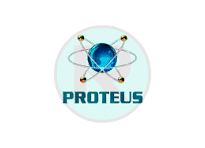

  <h1 align="center">Hi there, I'm Ignacio A. Schwindt 👋</h1>
  
  

  <strong>AI Engineer & Computer Engineering Student @ UNLP.</strong>  
  I bridge the gap between high-level logic and low-level signals, building <strong>software that thinks</strong> (AI/LLMs) and <strong>hardware that interacts</strong> (Embedded).

  
  
  

 

  

 

---

### 🔭 Featured Projects (AI & R&D)

| Domain | Project | Description |
| :--- | :--- | :--- |
| 🤖 **Realtime Live AI** | **[Realtime AI Avatar](https://github.com/igna-s/Realtime_Avatar_AI_Companion)** | End-to-end interface powered by **Google Gemini**. Features a customizable **VRM** character with low-latency voice interaction. |
| ⚛️ **RAG & Quantum** | **[Qiskit Migration Assistant](https://github.com/igna-s/Qiskit-RAG-Migration-Assistant)** | **RAG pipeline** designed to migrate legacy Quantum code using **n8n** and **VectorDBs** for context-aware suggestions. |
| 🧠 **AI Core** | **[Michigrad Engine](https://github.com/igna-s/Michigrad-Autograd-Engine)** | Scalar-valued **autograd engine** implemented from scratch. Replicates PyTorch's logic to demonstrate **backpropagation**. |
| 🛡️ **Embedded** | **[Embedded Security CIAA](https://github.com/igna-s/Embedded-Security-System-CIAA)** | Real-time system for **EDU-CIAA (ARM Cortex-M4)**. Features **FSM logic**, interrupt handling, and GPIO management in C. |
| 🖐️ **IoT/Hard** | **[Multitouch Surface](https://github.com/igna-s/IoT-Multitouch-Surface)** | Low-cost interactive surface powered by **ESP8266** and **HX711** load cells with real-time pressure visualization. |
| 🎮 **Python Dev** | **[Python Arcade Platform](https://github.com/igna-s/Python-Arcade-Games)** | Modular arcade collection recreated with **Pygame**. Features **OOP Design** and game logic implementation. |

> 🏆 **Competitive Excellence:** Finalist at the **2025 ICPC South America South Regionals**. Check my [ICPC Archive](https://github.com/igna-s/ICPC-Regional-Finals-2025).

---

### 🛠️ Technical Arsenal

#### 🧠 AI, LLMs & Data Engineering
| Python | TensorFlow | PyTorch | LangChain | Gemini | n8n | Scikit-Learn | Pandas |
| :---: | :---: | :---: | :---: | :---: | :---: | :---: | :---: |
|  |  |  |  |  |  |  |  |

#### ⚛️ Quantum Computing
| Qiskit | PennyLane |
| :---: | :---: |
|  |  |

#### 💻 Software Engineering & Tools
| C# | Java | Unity | Docker | Git | Linux |
| :---: | :---: | :---: | :---: | :---: | :---: |
|  |  |  |  |  |  |

#### 🌐 Full Stack Web Development
| React | JavaScript | Node.js | Vite | Bootstrap | MySQL | Postman |
| :---: | :---: | :---: | :---: | :---: | :---: | :---: |
|  |  |  |  |  |  |  |

#### 🔌 Embedded Systems (Hardware Foundation)
| C | C++ | Assembly | ESP32 | Arduino | MATLAB | SolidWorks | Proteus |
| :---: | :---: | :---: | :---: | :---: | :---: | :---: | :---: |
|  |  |  |  |  |  |  |  |

---

### 🌐 Web Development Profile

In addition to Engineering & AI, I craft web interfaces.
Check out my Web Dev projects here:
 

---

### 📊 Engineering Metrics

  

    
  

  

    
    
  

 

  <h4>🔥 My Contribution Streak</h4>
  

